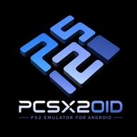

<div align="center">



# PCSX2OID

[](https://www.gnu.org/licenses/gpl-3.0.html)

</div>

PCSX2OID é uma modificação do emulador PlayStation 2 para dispositivos ARM, baseado no projeto ARMSX2. Esta versão foi adaptada e modificada pela **A Casa do Emulador**.

## Sobre o Projeto

PCSX2OID é um emulador gratuito e de código aberto para PlayStation 2 em dispositivos ARM, permitindo jogar jogos de PS2 no Android e outras plataformas ARM.

### Origem do Código Fonte

Este projeto é uma modificação do **ARMSX2**, que por sua vez é baseado no **PCSX2** (o emulador de PS2 mais conhecido e avançado) e no **PCSX2_ARM64** (port para ARM64 pelo desenvolvedor Pontos).

O ARMSX2 foi criado após anos de não existir um emulador de PS2 de código aberto para sistemas ARM. O desenvolvedor [@MoonPower](https://github.com/momo-AUX1), com o apoio de [@jpolo1224](https://github.com/jpolo1224), decidiu portar um novo emulador de PS2 para Android, fazendo um fork do repositório PCSX2_ARM64 do desenvolvedor Pontos.

A **A Casa do Emulador** modificou e adaptou este projeto para criar o PCSX2OID, mantendo o foco em trazer a emulação moderna de PS2 para plataformas ARM.

## Requisitos do Sistema

PCSX2OID suporta qualquer dispositivo com capacidade ARM, incluindo plataformas Android, iOS, Linux e Windows. O desempenho depende das capacidades de hardware do seu dispositivo.

**Nota:** É necessário um dump de BIOS de um console PS2 legitimamente adquirido para usar o emulador.

## Créditos

### PCSX2
[PCSX2](https://github.com/PCSX2/pcsx2) - O PCSX2OID não seria possível sem o trabalho lendário da equipe PCSX2 e sua paciência e compreensão em relação a este projeto!

### ARMSX2
[ARMSX2](https://github.com/ARMSX2/ARMSX2) - Este projeto é uma modificação baseada no trabalho do ARMSX2, que originalmente começou como um fork do trabalho do desenvolvedor Pontos ([PCSX2_ARM64](https://github.com/pontos2024/PCSX2_ARM64)).

Agradecimentos aos desenvolvedores do ARMSX2:
- [@MoonPower](https://github.com/momo-AUX1) - Desenvolvimento principal
- [@jpolo1224](https://github.com/jpolo1224) - Suporte e desenvolvimento
- [@fffathur](https://github.com/fffathur) e [@Vivimagic](https://github.com/Vivimagic) - Criação e trabalho no logo
- [@tanosshi](https://github.com/tanosshi) - Trabalho no website

### A Casa do Emulador
Modificação e adaptação do projeto ARMSX2 para criar o PCSX2OID.

## Por que existem arquivos .js e .jsx?

Originalmente, as telas em React Native eram apenas um experimento que foi mantido. Elas são extremamente básicas e serão finalizadas em uma branch separada ou removidas completamente. Não afetam o desempenho pois estão ocultas por padrão e não são executadas. Qualquer PR é bem-vinda!

### Para começar a desenvolver com PCSX2OID RN:

1. Primeiro instale as dependências:
```sh
npm install
```

2. Compile o PCSX2OID com o core React Native:
```sh
./gradlew assembleDebug -PenableRN=true
```

Agora você terá um novo botão no canto superior direito da tela de seleção de jogos. Clique nele para começar a desenvolver com hot reload e ver suas alterações sem recompilar (nota: compilar com RN muda o emucore de estático para compartilhado).
